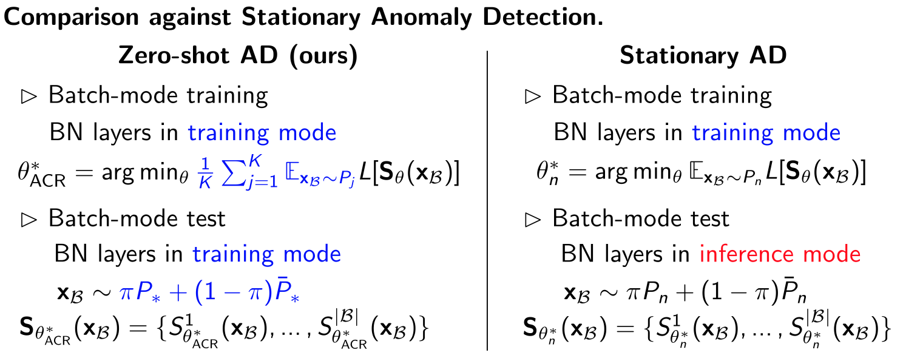

# Zero-Shot Anomaly Detection via Batch Normalization

Official code repository for NeurIPS 2023 paper [Zero-Shot Anomaly Detection via Batch Normalization](https://arxiv.org/abs/2302.07849).

Code for different datasets is shown in the folder names. Refer to each folder for the datasets of interest. 
- [MVTec AD](https://github.com/aodongli/zero-shot-ad-via-batch-norm/tree/main/mvtec-ad)
- [AnoShift, CIFAR100-C, Omniglot](https://github.com/aodongli/zero-shot-ad-via-batch-norm/tree/main/anoshift-cifar100c-omniglot)

Package requirements are listed in each folder's `requirements.txt`. Run `pip install -r requireme.txt` to install all packages.

## Quick Introduction
Our proposed zero-shot anomaly detection method is a simple but effective framework. One only needs to ensure i) the model is for batch-level prediction and ii) the batch norm layers are kept in the training mode even at inference time. See the comparisons against the stationary anomaly detection framework below.



---------
```
@inproceedings{acr,
  title={Zero-Shot Anomaly Detection via Batch Normalization},
  author={Li, Aodong and Qiu, Chen and Kloft, Marius and Smyth, Padhraic and Rudolph, Maja and Mandt, Stephan},
  booktitle={Thirty-seventh Conference on Neural Information Processing Systems},
  year={2023}
}
```
